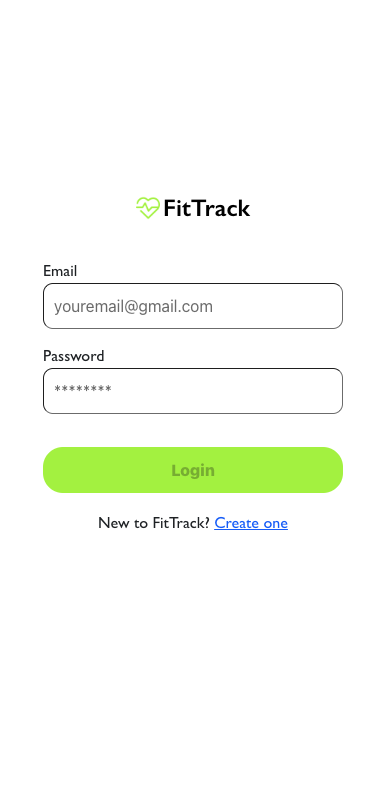
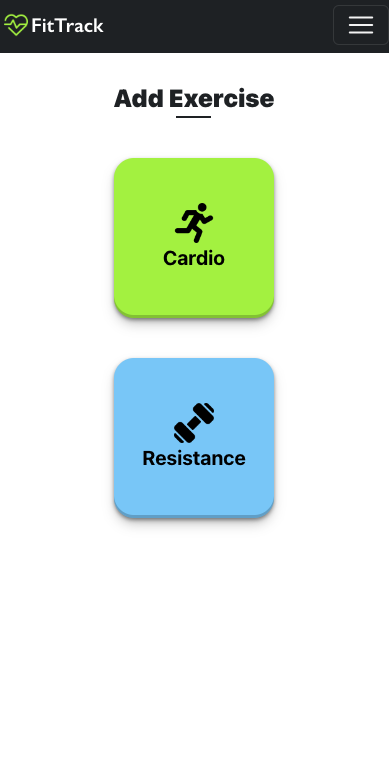

# FitTrack
A MERN-stack fitness tracker app.

## Table of Contents

- [Description](#description)
- [Technology](#Technology)
- [Installation](#installation)
- [Usage](#usage)
- [License](#license)
- [Contribution](#contribution)
- [Questions](#questions)

## Description:

A user-friendly MERN-stack application that enables individuals to easily track and manage their daily fitness routines. Key features include logging and tracking of both cardio and resistance exercises, viewing of workout history, and ability to delete exercises.

## Technology:

This Project utilized the following technologies:

- MongoDB and Mongoose - for database management.
- Express.js - for building the server and RESTful APIs.
- React.js - for creating an interactive and responsive user interface.
- Node.js - for server-side logic.
- JWT  -  Authentication for secure user access.
- Google Calendar API - synchronizing with google calendar, hence enabling synchronization between the app and the user's google calendar, ensuring that scheduled fitness activities and events are consistent.

## Installation

To run this project, install it locally using npm:

```
npm install
```

## Usage

After installing npm packages, the application will be invoked by using the following command:

```
npm run develop
```

<h3> Demo</h3>
<hr>
<ul>
<li><b>Demo</b> - click <a href="https://youtu.be/kH6c6tEs4TU?si=k7DFJQ4_8BfTkScV"><b>here </b></a>
<ul>


[Click me to see the app!](https://fit.emenikenath.com.ng)


#### Preview

- Home Page <br>
  

- Login Page <br>
  

- Exercise Page <br>
  

- Add Cardio <br>
  

- Add Resistance <br>
  

- History Page <br>
  
- Single Cardio History <br>
  

- Single Resistance History <br>
  

## License

[](https://opensource.org/licenses/MIT) <br>
This project is licensed under MIT, for more information please visit [this website](https://opensource.org/licenses/MIT)

## Contribution

- Icons are from www.flaticon.com
- Background  photos are from www.pexels.com
- Made with ❤️  by Emenike Nathaniel

## Questions?

Please feel free to contact me if you need any further information:


- <h3>Email</h3>
<hr>
- <p align="left"><b>Mail</b> - <a href="mailto:emenikenathaniel55@gmail.com"><i>emenike.nathaniel@gmail.com</i></a></p>

- [Github Profile](https://github.com/githubnath)


<h3>Linkedin</h3>

<ul>
        <li><a href="https://www.linkedin.com/mwlite/in/nathaniel-emenike">Emenike Nathaniel</a> - Author's  Linkedin
</ul>


<h3>Twitter</h3>

<ul>
        <li><a href="https://www.twitter.com/EngrNath3">Emenike Nathaniel</a> - Author's  Twitter Handle
</ul>
